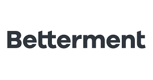
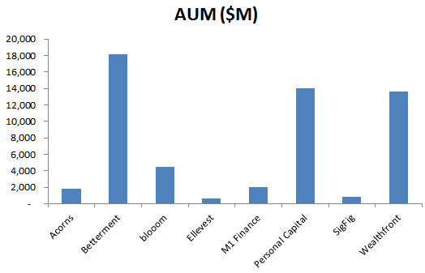
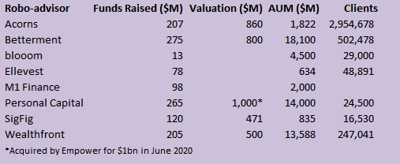
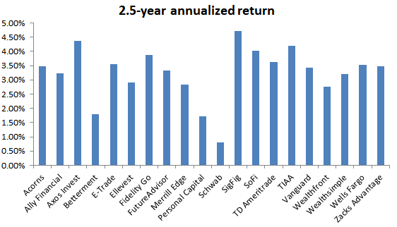
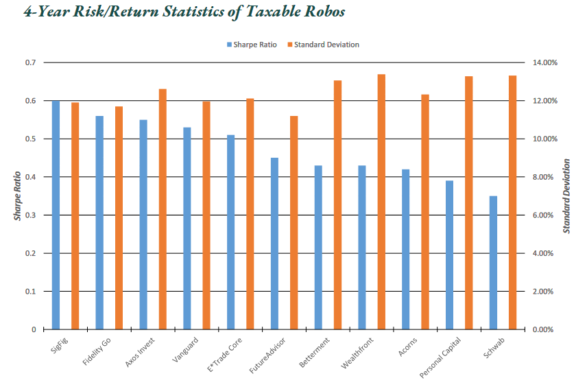

# Unit 1 Homework Assignment: FinTech Case Study

## Overview and Origin

* When was the company incorporated?

Incorporated in Delaware on January 29, 2008, Betterment Holdings, Inc, is the parent company for Betterment LLC (originally founded in April 2009) and Betterment Securities (a broker/dealer). (1)

* Who are the founders of the company?

Jon Stein (Columbia MBA grad) and Eli Broverman (NYU Law grad)

* How did the idea for the company (or project) come about?

Stein initially formed the idea for the company in 2008 when considering the mistakes he was making with his own personal investments. He wanted to build a platform that "told me what to do with my money, and then did it" (1), so he would not fall into typical bad investing habits, such as trying to time the market, selling winners too soon, and churning his portfolio. He initially planned to build the entire platform himself, but had no programming background, so he turned to his roommate at the time, Harvard CS major, Sean Owen. With Stein and Owen building the service, Broverman covering the regulatory implications, and Stein's girlfriend, Polina Khentov, a graphic designer, designing the prototype, the idea turned into a viable business plan.

* How is the company funded? How much funding have they received?

Starting in August 2008, Stein and Broverman started with $320k from personal savings and angel funding. The site went live in May 2010, and the firm entered **TechCrush Disrupt New York** in June, winning the award of "Biggest New York Disruptor". In less than 24 hours, 500 people have signed up for the service. In November, the firm received Series A funding from Bessemer Venture Partners to the tune of $2m (plus another $1m from a few other investors). In October 2012, Menlo Ventures provided $10m in Series B funding, along with Bessemer and Anthemis Group. (1, 2, 3)

## Business Activities:

* What specific financial problem is the company or project trying to solve?

Betterment is primarily a retail robo-advisor, designed to automate goal-based investing at comparatively low fees, while also providing cash management and retirement services. The idea is to remove the behavioral biases that most investors exhibit and produce a portfolio rooted in modern portfolio theory (MPT), utilizing low cost ETFs, that automatically rebalances periodically and implements tax-loss harvesting to maximize returns for an investor's desired level of risk. Along with MPT, the platform's algorithms rely on the Black-Litterman model, Fama-French model, CAPM, and Monte Carlo simulations. Further, the company offers SRI, smart beta, and income focused products, along with high yield savings accounts and extensive educational materials. (2)

* Who is the company's intended customer?  Is there any information about the market size of this set of customers?
What solution does this company offer that their competitors do not or cannot offer? 

The company's intended customers are young Millennials that like to do things on their own, via technology, and do not have enough assets (or the desire) to work with a professional money manager, as well as those that see traditional advisors' fees as too high and the service underwhelming. This market size is obviously enormous, with a reported 72m Millennials in the US as of 2019 (5).
While there are many robo-advisors out there, including large traditional financial institutions starting their own, Betterment is the largest independent firm in the space, with 500,000 customers and over $18b in AUM (as of June 2020). They offer low management fees (0.25%) and $0 minimum balances (compared to $500 at Wealthfront and $100k at Personal Capital). They also offer fractional share investing and asset location (i.e., tax coordination) across accounts, which many others do not. Lastly, Betterment's site is filled with educational articles and white papers aimed at new investors. (2)

* Which technologies are they currently using, and how are they implementing them? 

Betterment has a large technology stack. They use Ruby on Rails for app development as well as server-side programming using Ruby, Java, Scala, C#, C++, and Python. They make extensive use of the cloud, both via AWS and the Google Cloud Platform. Mobile apps are developed using Objective-C, Swift, Java and Kotlin, and they are further building the stack by diving into Dart and Flutter. Other technologies used in the firm include PHP, HTML, Javascript, and MySQL. (7, 8, 9)

## Landscape:

* What domain of the financial industry is the company in?

Betterment is a part of the Wealth Management industry, specifically targeting the retail market, serving as a robo-advisor. In fact, Betterment is considered one of the very first robo-advisors, a distinction that has led to its popularity versus competitors as it enjoys a first-mover advantage. As previously mentioned, the firm caters to young adults that prefer low fees and instructive technology, as compared to high fee financial advisors that provide subpar services or only cater to high net worth individuals. 

* What have been the major trends and innovations of this domain over the last 5-10 years?

While the financial techniques used are nothing new (e.g., MPT, CAPM) to the investment community, the major trend that robo-advisors has capitalized on is the distribution channel, namely the technological innovations of the past 10 years. Aware that the younger generation wanted to do everything digitally, Betterment and others jumped on this opportunity to offer low cost wealth management with the need for minimal (if any) human interaction. Now, young (middle class) adults can let the robo-advisor automatically rebalance their desired asset allocation, monitor their portfolio on their mobile phone or tablet, and rest assured the best techniques are being used for tax-loss harvesting and asset location across their portfolio, without paying exorbitant fees to a traditional financial advisor unable to beat the market.

Since the launch of Betterment in 2010, the landscape has evolved immensely, with assets managed by robo-advisors jumping to $19b by 2014. The first robo-advisor was then launched in China in 2015, and in 2016 the first platform targeted to women, Ellevest, launched. Global robo-advisor AUM by 2017 had hit $225b, with traditional money managers, such as Vanguard, entering the market, and the top three independent advisors managing nearly 560k client accounts. By the end of 2020, the Chinese market is expected to hit $900b in AUM, with global assets shooting to $4.6t by 2022. (10)

* What are the other major companies in this domain?

The domain contains both independent robo-advisors as well as units at traditional money managers trying to compete in the space. Independent advisors include Betterment, Wealthfront, Personal Capital, and Acorns. Traditional managers in the space include Vanguard, Schwab, TD Ameritrade, and T. Rowe Price.

as of June 2020 (11)

## Results

* What has been the business impact of this company so far?

Betterment has truly revolutionized how many invest, guiding assets away from traditional advisors permanently. By 2015, the company had become the largest robo-advisor in the world, just five years after launch. And by 2017 it remained the largest independent robo-advisor, managing over $10b. In the same year, traditional managers' profit margins had fallen by a third as more and more clients turned to robo-advisors like Betterment, further highlighting the industry impact of robo-advisors. (10)

* What are some of the core metrics that companies in this domain use to measure success? How is your company performing, based on these metrics?  How is your company performing relative to competitors in the same domain?

Success in the asset management business, whether at the traditional advisors or up-and-coming robo-advisors, is measured first and foremost in AUM. As the chart above shows, on this metric, Betterment is leading the pack. Beyond AUM, and considering many independent robo-advisors are new start-up, funds raised, valuation, and number of clients are key metrics of success. From the chart below we can see Betterment has raised the most funds in the space and is valued at the top end of its peer range. While Acorns has the most accounts, which is a result of its focus on micro-investing, where customers can round up purchases to buy fractional shares, Betterment comes in second.

Finally, as with any manager, survival depends on performance. No matter how novel the technology is, clients will not give funds to an underperforming advisor. Unfortunately, on this front, Betterment has underperformed its peers over the last 2.5 years (Dec 2017 to June 2020), returning just 1.8% in its taxable 60/40 stock/bond portfolio, compared to an industry average of 3.2%. Nonetheless, looking at a longer time horizon and taking risk into account, Betterment's taxable portfolio exhibits a Sharpe ratio of 0.43, in line with industry peers.

as of June 2020 (11)

## Recommendations

* If you were to advise the company, what products or services would you suggest they offer? Why do you think that offering this product or service would benefit the company?

In addition to investing services, it should first be noted Betterment offers cash management, retirement (including employer 401(k) programs), and services for advisors, similar to many of its competitors. However, Betterment only offers ETF-based portfolios. Several competitors allow the investor to purchase individual stocks within their portfolio, as well as other ETFs that are not part of the defined portfolios. Investors may want to allocate a small portion of their overall portfolio to a "hot stock" or take a risk on an interesting sector of the market not offered in the Betterment portfolio options. Of course, they could do this in a separate brokerage account outside of Betterment, but by allowing the client to do this on the Betterment platform, the firm better captures the client's entire investment portfolio, making future advise more appropriate. If prospective clients knew this was an option, they may select Betterment over a competitor with this differentiated offering.

* What technologies would this additional product or service utilize? Why are these technologies appropriate for your solution?

While the underlying financial techniques (MPT, CAPM, etc.) already utilized would suffice for this new product, the firm would need additional data and analytics to cover more illiquid parts of the market for incorporation into their asset allocation methodology. For example, Betterment portfolios are made up strictly of stock and bond ETFs at the moment, including US small and large cap, international developed stocks and bonds, emerging market stocks and bonds, US treasuries, inflation protected bonds, and US munis. They do not include assets such as commodities, REITs, or liquid alts. By offering clients these as investment options, risk factors would have to be computed for these assets, in use in the overall asset allocation process. This requires gathering the appropriate historical data for these assets, which can be hard and sparse; assumptions about returns and risk may have to be developed and included in the portfolio optimization and rebalancing process. These techniques are appropriate for this solution as the firm continues to use cutting-edge methodologies in portfolio management.

## Addendum 
(1) https://www.betterment.com/

(2) https://en.wikipedia.org/wiki/Betterment_(company)

(3) https://www.inc.com/magazine/201303/robin-d-schatz/how-we-got-funded-betterment.html

(4) https://www.bankrate.com/investing/betterment-app-review/

(5) https://www.statista.com/statistics/797321/us-population-by-generation/

(6) https://www.investopedia.com/best-robo-advisors-4693125

(7) https://betterment.engineering/

(8) https://stackshare.io/betterment/betterment

(9) https://stack.g2.com/company/betterment

(10) https://roboadvisors.com/history-of-robo-advisors/index.html

(11) https://www.backendbenchmarking.com/the-robo-report/

